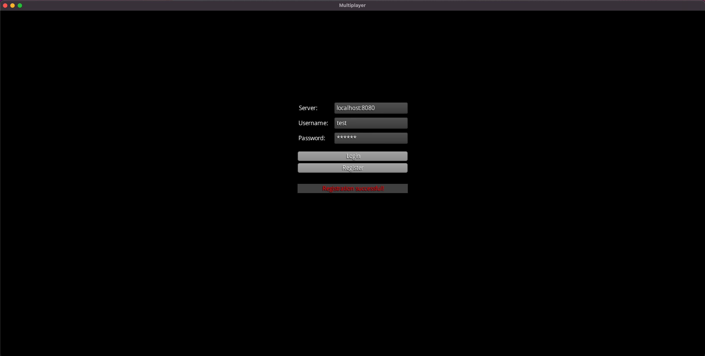
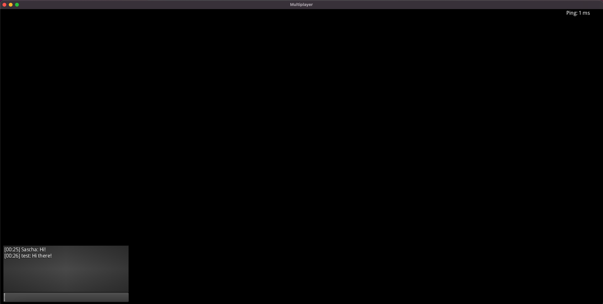

# LibGDX multiplayer authentication flow

About 10 years ago I was really into game development. It was fascinating to me how so big simulations are working. Especially multiplayer games with real time interactions. It looses a bit of the magic after I found out about how all the engines and algorithms are working. But a short while ago I was again a bit catched by the idea of creating my own multiplayer game. So I decided to get a bit into game development again and open source some of my work. So I also open sourced this part.

## Requirements
- Java 17

## Setup

1. Clone this repo
2. Navigate into the `client` directory
3. Run `./gradlew clean build`
4. Navigate into the `server` directory
5. Run `./gradlew clean build`

## Run the game

1. Navigate into the `client` directory
2. Run `./gradlew run`
3. Navigate into the `server` directory
4. Run `./gradlew bootRun`

## Functionality

It's a basic authentication / login workflow with a LibGDX client and Spring Boot server with the following functionality:
1. Menu handling
2. Login
3. Registration
4. Progressive loading screen
5. Session handling
6. Ping functionality to get the current latency
7. Chat

## Architecture
### Client
The client consists of two main parts.

The first is the default LibGDX architecture. In this example we've a desktop project with all the specialties for the desktop platform as well as the core project with the code that is shared between all the platforms.

The second part is the client lib which is completely independent of LibGDX so it could be also used in other game frameworks and engines. The client lib is used by the LibGDX architecture to communicate with the server.
### Server
Spring boot is used as the server framework. There are HTTP endpoints to register and login as well as websocket endpoints for the ping functionality and the chat.

H2 is used because of its simplicity as the database for this project.

### Communication

The communication between client and server are done with a JSON for simplicity reasons. It will probably not be an ideal solution for a final game.

## Disclaimer

Please keep in mind that this is just an example and not made for production use. It can be seen more like a proof of concept. So I haven't implemented a strong kind of security features.
